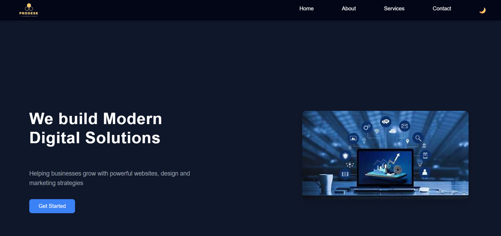
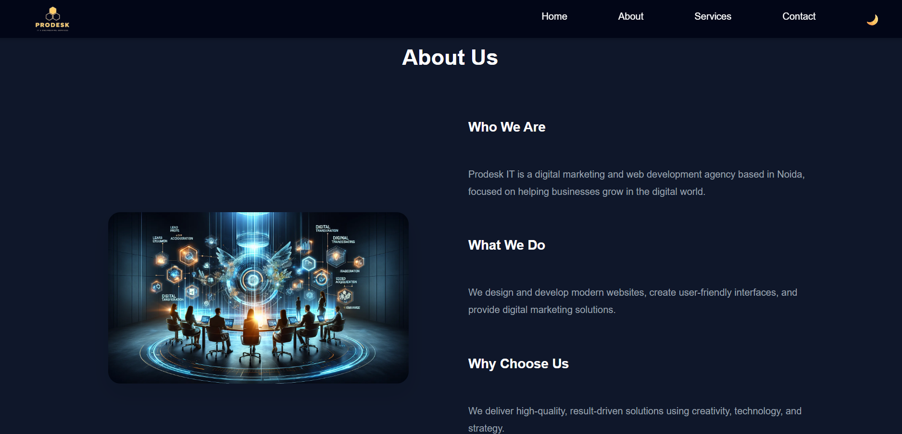
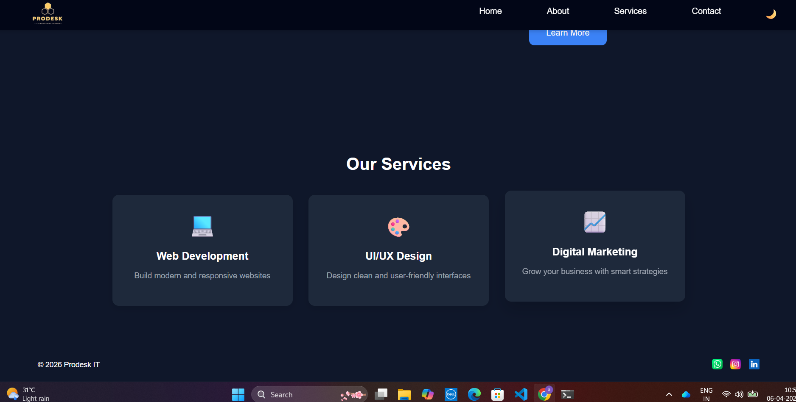
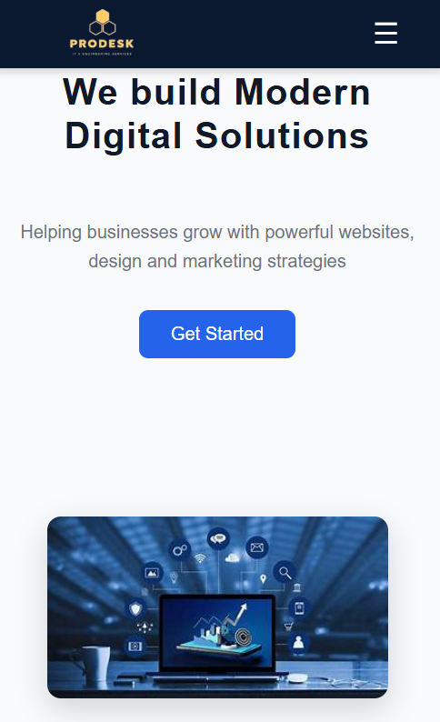
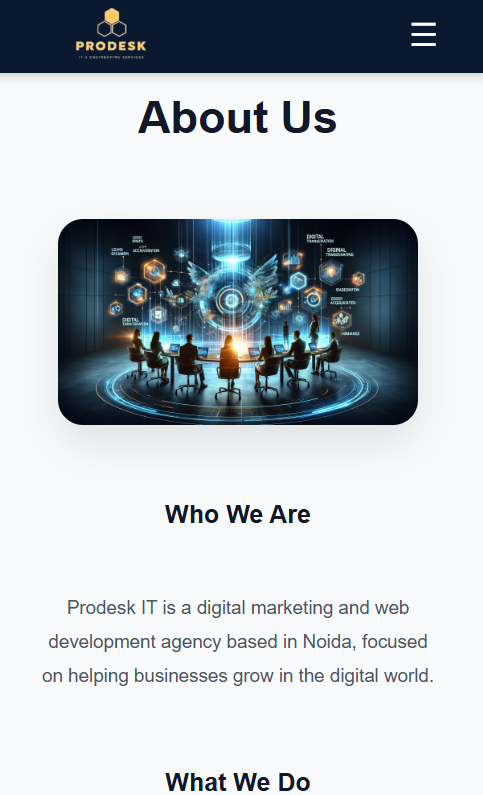
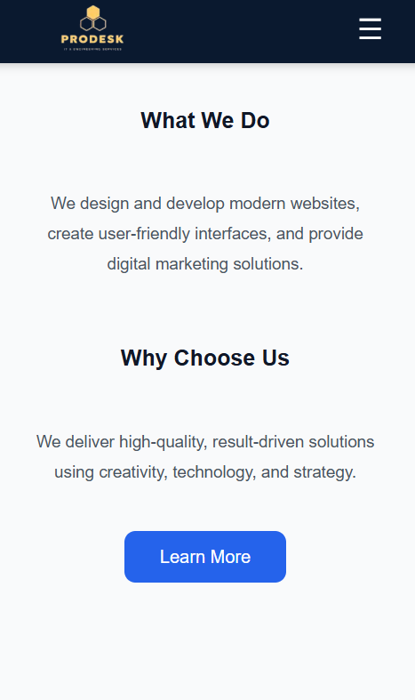
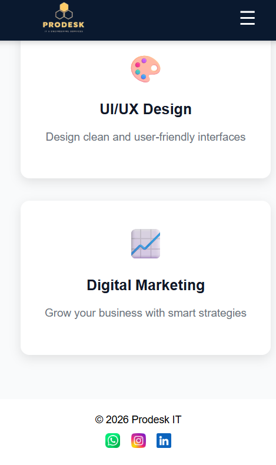

# Prodesk IT - Digital Agency Website

This is a responsive digital agency website built as part of Week 1 internship task.

## Features
- Responsive design (Mobile & Desktop)
- Sticky Navbar
- Hero Section with CTA
- About Section
- Services Section (3 cards)
- Footer with social icons
- Dark Mode Toggle
- Micro-interactions (hover effects)

## Technologies Used
- HTML
- CSS (Flexbox & Media Queries)
- JavaScript

## Project Screenshots

### Desktop View
Home Section

About Section

Service Section

### Mobile View
Home Section

About Section

Service Section

footer Section

 Project Structure
- index.html → Main file
- images/ → All images used
- README.md → Project documentation
- Prompts.md → AI prompts used

 Note
This project was built using raw CSS without any frameworks like Bootstrap or Tailwind.
